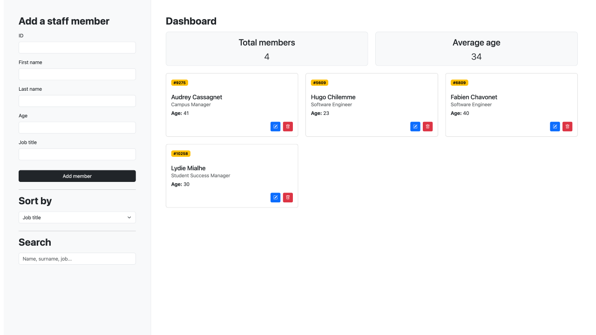
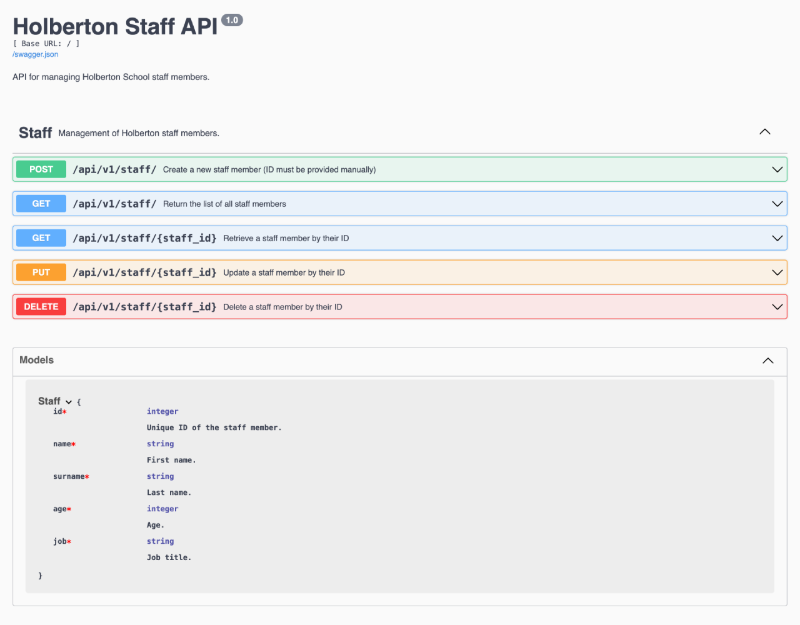
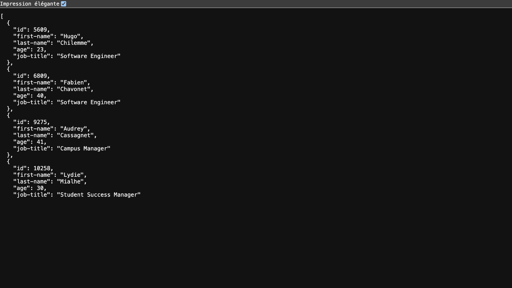

# Holberton Staff API

## Description

This project was developed during a live-coding session with a junior cohort at Holberton School Toulouse. It was presented live on campus and was not recorded. Its purpose is to demonstrate the rapid setup and ease of use of Flask combined with Flask-RESTX for creating a RESTful API. Although not suitable for production, this example provides:

- An in-memory API to manage Holberton School staff members (create, read, update, delete).
- Swagger (OpenAPI) documentation accessible via a built-in UI.
- A simple web front-end to interact with the API.

## Objectives

- Showcase how quickly an API can be bootstrapped with Flask and Flask-RESTX.
- Introduce RESTful principles (endpoints, HTTP methods, status codes).
- Provide hands-on experience with Swagger documentation.
- Build a minimal front-end for testing and demonstration.

## Tech Stack


## File Description

| **FILE**          | **DESCRIPTION**                                                   |
| :---------------: | ----------------------------------------------------------------- |
| `assets`          | Contains the resources required for the repository.               |
| `app`             | Application package with factory (`__init__.py`) and API modules. |
| `run.py`          | Entry point to start the Flask development server.                |
| `requirements.txt`| List of dependencies required for the script.                     |
| `.gitignore`      | Specifies files and folders to be ignored by Git.                 |
| `README.md`       | The README file you are currently reading 😉.                     |

## Installation & Usage

### Installation

1. Clone this repository:
    - Open your preferred Terminal.
    - Navigate to the directory where you want to clone the repository.
    - Run the following command:

```
git clone https://github.com/fchavonet/live_coding-holberton_staff_api.git
```

2. Open the cloned repository.

3. Create a virtual environment:

```
python3 -m venv venv
```

4. Activate the virtual environment:

```
source venv/bin/activate
```

> On Windows: `venv\Scripts\activate`.

5. Install dependencies:

```
pip install -r requirements.txt
```

### Usage

1. Run the `run.py` script to start the server:

```
python run.py
```

> The server will start in debug mode on port 3000 (you can change it in the `run.py` file).

2. You can interact with the API using command-line tools:

- Create a staff member:

```
curl -X POST "http://127.0.0.1:3000/api/v1/staff/" \
     -H "Content-Type: application/json" \
     -d '{"id":6809,"first-name":"Fabien","last-name":"Chavonet","age":20,"job-title":"Software Engineer"}'
```

- List all staff members:

```
curl http://127.0.0.1:3000/api/v1/staff/
```

- Retrieve a specific staff member:

```
curl http://127.0.0.1:3000/api/v1/staff/6809
```

- Update a staff member:

```
curl -X PUT "http://127.0.0.1:3000/api/v1/staff/6809" \
     -H "Content-Type: application/json" \
     -d '{"id":6809,"first-name":"Fabien","last-name":"Chavonet","age":40,"job-title":"Software Engineer"}'
```

- Delete a staff member:

```
curl -X DELETE http://127.0.0.1:3000/api/v1/staff/6809
```

3. Alternatively, use the front-end interface or Swagger to test the API:

- Front-end: [http://127.0.0.1:3000](http://127.0.0.1:3000)

<p align="center">
    
</p>

- Swagger UI (API docs): [http://127.0.0.1:3000/api/](http://127.0.0.1:3000/api/)

<p align="center">
    
</p>

- JSON (data): [http://127.0.0.1:3000/api/v1/staff/](http://127.0.0.1:3000/api/v1/staff)

<p align="center">
    
</p>

## What's Next?

- Persist data with a database (SQLAlchemy).
- Add authentication and authorization (JWT).
- Implement pagination and filtering at the API level.
- Improve the front-end with modern frameworks.
- Deploy to a production environment.

## Thanks

- Special thanks to the [Holberton School Toulouse](https://www.holbertonschool.fr/campus/toulouse) staff and students, especially the cohort #26, for their dedication and attention during the live-coding session.

## Author(s)

**Fabien CHAVONET**
- GitHub: [@fchavonet](https://github.com/fchavonet)
